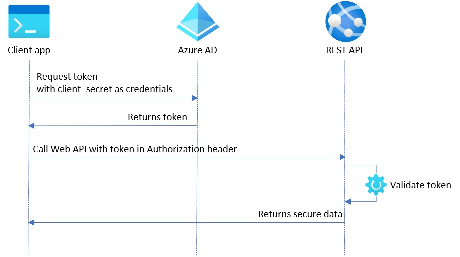
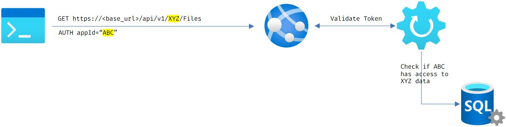
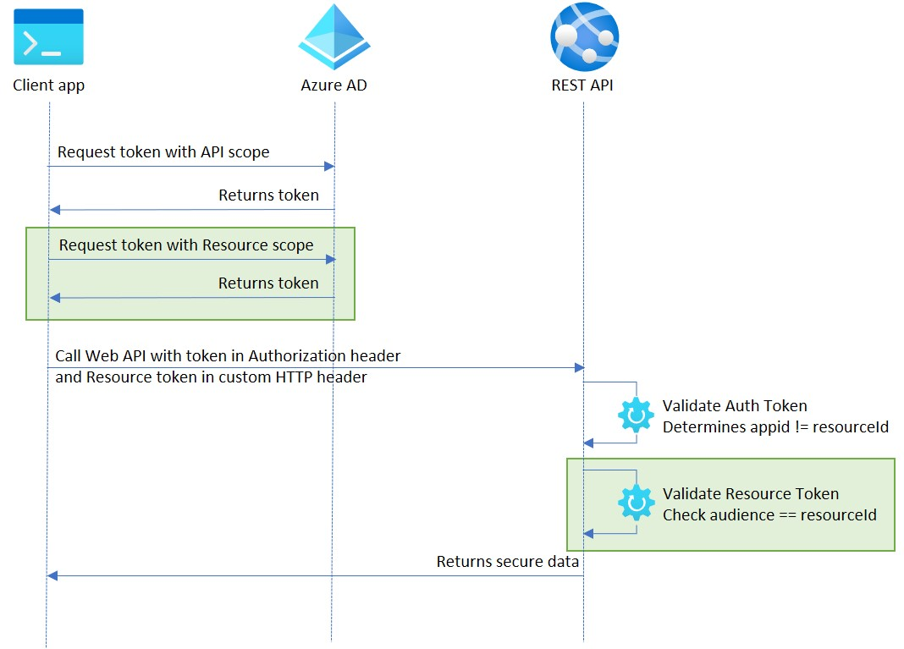
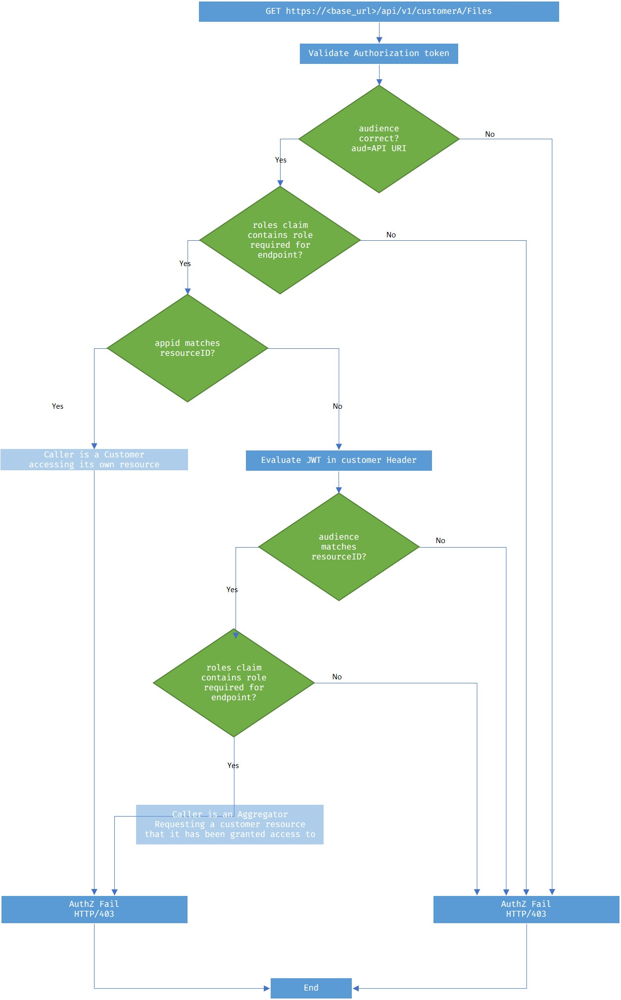

# Azure Active Directory - Authorization of third-party access to API

The code in this repo is meant to describe a scenario where we want to allow an identity to access an Azure Active Directory protected API on behalf of one or multiple other identities.

The problem and the proposed solution are detailed in this documentation. The repository includes code both in Java and C# (.NET core) implementing the scenario.

- [Azure Active Directory - Authorization of third-party access to API](#azure-active-directory---authorization-of-third-party-access-to-api)
  - [Introduction](#introduction)
    - [Example: using requester ID as the resource identifier](#example-using-requester-id-as-the-resource-identifier)
    - [Example: authorizing requester ID access to resources](#example-authorizing-requester-id-access-to-resources)
    - [The problem: the aggregator scenario](#the-problem-the-aggregator-scenario)
  - [Solution](#solution)
  - [A practical example](#a-practical-example)
    - [customerA tries to access their own data](#customera-tries-to-access-their-own-data)
    - [aggregatorX tries to access customerA data without supplying the additional token](#aggregatorx-tries-to-access-customera-data-without-supplying-the-additional-token)
    - [aggregatorX accesses customerA data supplying two tokens](#aggregatorx-accesses-customera-data-supplying-two-tokens)
  - [Token validation process](#token-validation-process)
  - [Next Steps](#next-steps)

## Introduction

A common pattern for protecting an API with Azure Active Directory is the usage of access tokens that are sent in the Authorization header of an HTTP request. This token will consist on a number of claims that can be validated by the API to determine if the requester is authorized to access the API itself and the resources exposed by it.

In a typical example, we use the OAUTH client credentials grant flow to authorize an application to access an API.



Using Azure AD, both the API and the client application need to have a corresponding app registration, and the client app needs to have a set of permissions (roles) over the API.

The requesting application requests an access token from Azure AD to access the protected API. The generated token is a JWT (Json Web Token) including a set of claims that include the following:

- `aud` - specifying the audience for this token, tipically the App URI for the API in Azure AD
- `appid` - the client ID for the client application registration in Azure AD
- `roles` - the set of roles granted to the calling application, as defined in the API permissions section in Azure AD.

> Note: the claim names will vary depending on OAuth version. This is for v1, however, corresponding claims exist on v2 tokens.

In a simple token validation process we can use these claims to check the following rules:

- We can use the `aud` claim to ensure the token is meant for our protected API.

- We can use the `roles` claim in the token to authorize access to a particular API method. Roles are meant to be generic though, so it might not be enough to check this claim as we may be building a multi-tenant system in which we need to protect information from leaking.

- An additional check might be required to verify the `appid` matches an identity that has access to the resources retrieved by the API call.

This is a standard practice in OAUTH flows in which that determination is done at the resource level: for instance, I can grab a token for an email service providing me with `Mailbox.Read` access, but the actual determination that I have access to my mailbox and not someone else's mailbox is done by the email service rather than something that is included in the token itself.

### Example: using requester ID as the resource identifier

This API call is meant to list Files that belong to a particular entity in a multi-tenant environment. In this REST API, we use the `appid` contained in the token as the resource identifier, meaning that we will only ever retrieve files owned by that entity.

```bash
GET https://<base_url>/api/v1/Files
```

This is a safe implementation however it lacks flexibility. In this case we don't need to do any additional checks because the identity included in the token is our data filter. However, there are some scenarios where we might want to specify the resources on the request itself.

### Example: authorizing requester ID access to resources

This is a modified version of the previous API where we specify an ID in the request, to filter the files that are retrieved.

```bash
GET https://<base_url>/api/v1/{customerId}/Files
```

This type of API is useful in any scenario where we want to allow a particular identity to access data from other entities.

The problem here is that the token presented might have no direct connection to the resources being accessed. That means that the API needs to do some additional work to validate this request and make sure the calling application is not trying to retrieve unauthorized resources from a different customer.

### The problem: the aggregator scenario

In more advanced scenarios, we may want to have client identities that act on behalf of other identities. A typical example is an `aggregator` entity that interacts with our system on behalf of several other clients: these clients can access their data directly, but they can also delegate some operations to the aggregator.

Currently, there is no clean way of doing this in Azure Active Directory as there aren't any claims in app access tokens that can be used to represent this aggregator-client relationship.

The typical solution for this problem is to keep a system-managed ledger of authorizations: some table that connects requester IDs to resources. And we would additionally have to build some process to update that table when clients authorize/deny aggregators to act on their behalf.



This means that we would now have two different places to manage authorization: the Azure Active Directory app registrations and our permissions database which will add complexity and potential security issues to our system.

## Solution

Some requirements we want to meet with the proposed solution:

- All permission management is done in Azure Active Directory
- Permissions are granular - aggregator is given access to specific client permissions
- Identities are kept specific - both aggregators and clients have their own identity, and we want to be able to track if a request is done by a client to access their own data, or by an aggregator acting on behalf of the client
- API can be protected by standard token security checks

To achieve this we propose that the *aggregator* scenario is implemented using a two-token system:



In this system, the aggregator requests a token from Azure AD that will grant access to this identity over the protected API.

In order to access customer's data, the request must provide a second token in a custom HTTP Header. This seconday token grants access to the aggregator ID over the customer's data and includes its own set of roles that allow for granular permission setting.

Both tokens are generated by Azure AD by specifying a different scope on the token request: the standard authorization token targets the protected API's ID, the secondary token targets the customer ID.

## A practical example

Let's say we have the following app registrations in Azure AD:

- `secureAPI` - is the app registration for the Web API, it defines roles such as "`Files.List`" and "`Files.Write`"
- `customerA` - is the app registration for one customer. This allows the customer to request tokens with this identity
- `aggregatorX` - is the app registration for an aggregator entity. This allows the aggregator to request tokens with this identity.

There are three 3 possible cases for accessing the following URL:

```bash
GET https://<base_url>/api/v1/customerA/Files
```

### customerA tries to access their own data

In this case, customerA only needs to request a token for accessing the API and include it in the authorization header:

| claim | value                       |
|-------|-----------------------------|
| aud   | secureAPI scope             |
| appid | customerA                   |
| roles | "Files.Read", "Files.Write" |
</br>

**Validation is successful** because the audience is correct, the requested role for this operation "`Files.Read`" is included in the token and the identity of the requester (appid) matches the resource ID specified in the URL.

### aggregatorX tries to access customerA data without supplying the additional token

To access the API, aggregatorX requests a token and includes it in the authorization header:

| claim | value                       |
|-------|-----------------------------|
| aud   | secureAPI scope             |
| appid | aggregatorX                 |
| roles | "Files.Read", "Files.Write" |
</br>

The requests **will not be authorized** because the appid doesn't match the resource ID specified in the URL and the additional token was not provided. Based on the token provided we can only infer that aggregatorX has enough rights to call the API, but we have no indication that is authorized to access customerA data.

### aggregatorX accesses customerA data supplying two tokens

As depicted in the diagram above, aggregatorX will request two tokens: one to access the API and another one to access customerA's data:

**Token in Authorization Header**:

| claim | value                       |
|-------|-----------------------------|
| aud   | secureAPI scope             |
| appid | aggregatorX                 |
| roles | "Files.Read", "Files.Write" |
</br>

**Token in Custom Header**:

| claim | value                       |
|-------|-----------------------------|
| aud   | customerA scope             |
| appid | aggregatorX                 |
| roles | "customerA.Files.Read"      |
</br>

**Validation is successful** because we can infer that aggregatorX has enough rights to access the API and the secondary token provides indication that aggregatorX has access to customerA's data.

Notice how we can apply a different set of permissions at the customer level, in this case aggregatorX only has `Read` access to customerA's data.

> The roles are prefixed with the customer name to make it easier to identify in this example, but in a more streamlined implementation they can just mimic the roles defined at the API level as it will simplify the validation code.

## Token validation process

The following diagram details the entire validation process using the two token approach:



## Next Steps

To try a sample that implements this scenario, please follow the instructions in the [Setup.md](Setup.md) file.
