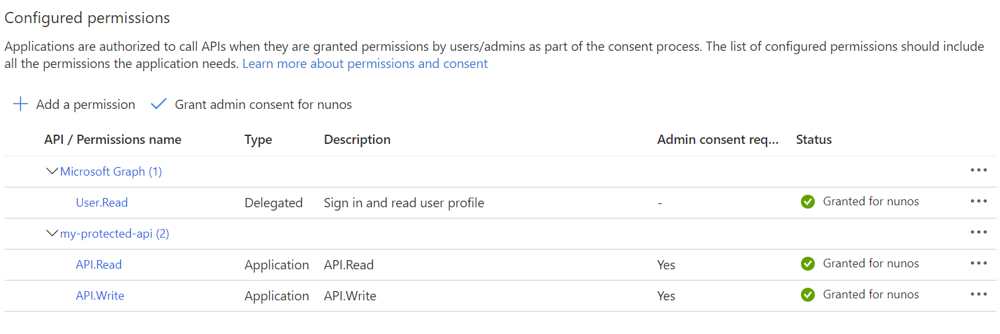
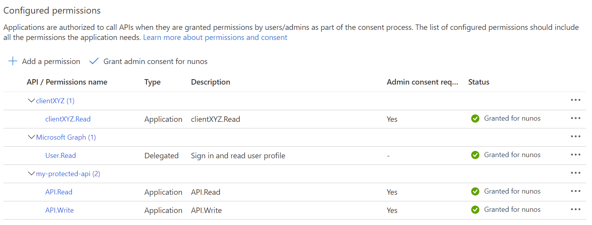

# Setting up the scenario

This documentation walks through the steps to setup the Azure AD app registrations and running the sample in this repo.

- [Setting up the scenario](#setting-up-the-scenario)
  - [Configuring Azure AD](#configuring-azure-ad)
    - [Creating the API registration](#creating-the-api-registration)
    - [Exposing the API](#exposing-the-api)
    - [Creating App Roles](#creating-app-roles)
  - [Registering Client Applications in Azure AD](#registering-client-applications-in-azure-ad)
    - [Creating the Client app registration](#creating-the-client-app-registration)
    - [Assigning permissions](#assigning-permissions)
    - [Enabling third-party access](#enabling-third-party-access)
  - [Creating the aggregator app registration](#creating-the-aggregator-app-registration)
  - [Gathering all configuration values](#gathering-all-configuration-values)
    - [`my-protected-api`](#my-protected-api)
    - [`clientXYZ`](#clientxyz)
    - [`aggregatorABC`](#aggregatorabc)
  - [Configuring the Sample](#configuring-the-sample)
  - [Running the Sample](#running-the-sample)

## Configuring Azure AD

To support the two-token system, we need to have the appropriate configurations in place on Azure AD.

### Creating the API registration

1. Sign in to the [Azure portal](https://portal.azure.com) and make sure you are in the correct Azure AD tenant.
2. In the portal menu, select the **Azure Active Directory** service, and then select **App registrations**.
3. Select **New registration**.
   - In the **Name** section, enter a meaningful application name, for example `my-protected-api`.
   - In the **Supported account types** section, select **Accounts in this organizational directory only ({tenant name})**.
   - Click **Register** button at the bottom to create the application.

### Exposing the API

Next step is creating an Application ID URI to identity your API for calling applications.

1. In the application registration for your application, select "Expose an API"
2. Next to the Application ID URI, click Set
3. By default, the application registration portal recommends that you use the resource URI `api://{app_client_id}`. This URI is unique but not human readable. If you change the URI, make sure the new value is unique. In this example we are using `api://my-protected-api`
4. Click Save

> Note: record the value of the Application ID URI (step 3) as you will need to supply this to client apps later.

### Creating App Roles

Because the clients of this API will be applications registered in Azure AD, we don't configure scopes and delegated permissions, rather we declare and expose only application permissions.

Currently in the portal there is no GUI to expose application permissions, so it needs to be done by manually editing the application **Manifest**:

1. In the application registration for your application, select Manifest.
2. To edit the manifest, find the appRoles setting and add application roles. The role definitions are provided in the following sample JSON block.
3. Leave allowedMemberTypes set to "Application" only.
4. Make sure id is a unique GUID.
5. Make sure displayName and value don't contain spaces.
6. Save the manifest.

The following sample shows the contents of `appRoles`, where the value of `id` can be any unique GUID:

```json
"appRoles": [
    {
    "allowedMemberTypes": [ "Application" ],
    "description": "Access the API with Read privileges",
    "displayName": "API.Read",
    "id": "7fab3cc5-9f2f-4094-8fdd-1a366c88255a",
    "isEnabled": true,
    "lang": null,
    "origin": "Application",
    "value": "API.Read"
    },
    {
    "allowedMemberTypes": [ "Application" ],
    "description": "Access the API with Write privileges",
    "displayName": "API.Write",
    "id": "5a5f9622-3667-4a00-9ecb-113ea3b788b7",
    "isEnabled": true,
    "lang": null,
    "origin": "Application",
    "value": "API.Write"
    }
    ],
```

> Note: this example creates two roles which can be used to determine two permission levels for APIs. These roles will be present in the JWT as a claim and can be validated by the API to authorize the request.

These roles are universal and not client specific. As an example: if an app with a particular clientId is granted "API.Read" it implies that it has permission to invoke the API with that access level, but further authorization is required to determine if this token can perform operations on resources pertaining to a specific client ID.

## Registering Client Applications in Azure AD

In this section we register a client application in Azure AD to represent an API client. The same process can be used to enable access to other calling applications (like test and development tools) that require access to the API in an authorized flow. We also assign it one or more of the app roles created in the previous section.

### Creating the Client app registration

1. Sign in to the [Azure portal](https://portal.azure.com) and make sure you are in the correct Azure AD tenant.
2. In the portal menu, select the **Azure Active Directory** service, and then select **App registrations**.
3. Select **New registration**.
   - In the **Name** section, enter a meaningful application name. In this example we will use `clientXYZ`
   - In the **Supported account types** section, select **Accounts in this organizational directory only ({tenant name})**.
   - Click **Register** button at the bottom to create the application.

### Assigning permissions

1. In the Application menu blade, click on the **Certificates & secrets**, in the **Client secrets** section, choose **New client secret**:
   - Type a key description (for instance `app secret`),
   - Select a key duration of either **In 1 year**, **In 2 years**, or **Never Expires** as per your security concerns.
   - The generated key value will be displayed when you click the **Add** button. Copy the generated value for use in the steps later.
   - You'll need to provide this key later to include in the client application's configuration files. This key value will not be displayed again, and is not retrievable by any other means, so make sure to note it from the Azure portal before navigating to any other screen or blade.

2. In the Application menu blade, click on the **API permissions** in the left to open the page where we add access to the Apis that your application needs.
   - Click the **Add a permission** button and then,
   - Ensure that the **My APIs** tab is selected
   - Select the **my-protected-api** that was created earlier
   - In the **Application permissions** section, select the applicable permissions (in this example it should be `API.Read` and `API.Write`)
   - Select the **Add permissions** button at the bottom.

3. At this stage, the permissions are assigned correctly but since the client app does not allow users to interact, the user's themselves cannot consent to these permissions.
   To get around this problem, we'd let the [tenant administrator consent on behalf of all users in the tenant](https://docs.microsoft.com/azure/active-directory/develop/v2-admin-consent).
   Click the **Grant admin consent for {tenant}** button, and then select **Yes** when you are asked if you want to grant consent for the requested permissions for all account in the tenant.
   **You need to be the tenant admin to be able to carry out this operation.**

This screenshot shows the state of a client application with permissions to access the **my-protected-api** application with the **API.Read** and **API.Write** roles:



### Enabling third-party access

Additionally, we now need to create a `scope` for this client identity so that we can allow another identity to act on its behalf.

1. In the application registration for your application, select "Expose an API"
2. Next to the Application ID URI, click Set
3. By default, the application registration portal recommends that you use the resource URI `api://{app_client_id}`. This URI is unique but not human readable. If you change the URI, make sure the new value is unique. In this example we are using `api://clientXYZ`
4. Click Save

We also need to define new roles that are client specific. The idea is that, when we give permissions to another identity to access this identity resources, we want to have granular control over the permissions that are added. As such, we will create replicas of the API roles defined before:

Click the **Manifest** button on the `clientXYZ` app registration and replace the `appRoles` property with the following values:

```json
    "appRoles": [
    {
    "allowedMemberTypes": [ "Application" ],
    "description": "Access clientXYZ data with Read privileges",
    "displayName": "clientXYZ.Read",
    "id": "7fab3cc5-9f2f-4094-8fdd-1a366c88255b",
    "isEnabled": true,
    "lang": null,
    "origin": "Application",
    "value": "clientXYZ.Read"
    },
    {
    "allowedMemberTypes": [ "Application" ],
    "description": "Access clientXYZ data with Write privileges",
    "displayName": "clientXYZ.Write",
    "id": "5a5f9622-3667-4a00-9ecb-113ea3b788b8",
    "isEnabled": true,
    "lang": null,
    "origin": "Application",
    "value": "clientXYZ.Write"
    }
    ],
```

Don't forget to **Save** the manifest.

## Creating the aggregator app registration

Now, create another client application to represent the `aggregator`. In this example, we will name it `aggregatorABC`.

The process is similar to registering the client application, but this time, when assigning permissions, make sure you assign permissions both to the `my-protected-api` (both roles) but also to the `clientXYZ` app roles (only Read).

Don't foget to also create a secret and take a note of the value as that will be required to request tokens from Azure AD.

This screenshot shows the state of the new client application with permissions to access the **my-protected-api** and also authorized to access **customerXYZ**'s resources in **read only** mode.



## Gathering all configuration values

This is a list of values you need to have noted down:

### `my-protected-api`

On the app registration **Overview** page:

- The **Application (client) ID**
- The **Directory (tenant) ID**
- The **Application ID URI**

### `clientXYZ`

On the app registration **Overview** page:

- The **Application (client) ID**
- The **Application ID URI**

Additionally you need the **Secret** value generated earlier, which can not be retrieved at this point.

### `aggregatorABC`

On the app registration **Overview** page:

- The **Application (client) ID**

Additionally you need the **Secret** value generated earlier, which can not be retrieved at this point.

## Configuring the Sample

With the above values collected we can now configure the sample to run and walkthrough the scenario. There is a Java and .NET version of the API on this app which will act as our `my-protected-api` app.

Open either the Java or .NET folder and modify the values in their respective configuration files. You only need the `my-protected-api` values listed above.

The *client* is just a series of HTTP requests defined in the client_requests.http file in this repo. To execute the http requests, we will need the following steps:

1. Install `humao.rest-client` extension in VSCode
2. Open the root of the repository in VSCode
3. Add these settings to your `.vscode/settings.json`. You may need to create the file if it doesn't already exist:

    ```json
    {
        "rest-client.environmentVariables": {
            "$shared": {
                "clientId": "REPLACE_WITH_CLIENT_ID_OF_CLIENTXYZ_APP",
                "clientSecret": "REPLACE_WITH_CLIENTXYZ_SECRET",
                "clientScope": "api://CLIENTXYZ_ID_URI/.default",
                "aggregatorId": "REPLACE_WITH_CLIENT_ID_OF_AGGREGATORABC_APP",
                "aggregatorSecret": "REPLACE_WITH_AGGREGATORABC_SECRET",
                "tenantId": "REPLACE_WITH_AZURE_AD_TENANT_ID",
                "apiScope": "api://<API_ID_URI/.default",
                "apiUrl": "http://localhost:8080"
            }
        }
    }
    ```

> Note: In this OAUTH flow, applications cannot ask for specific scopes, and must use the `resource/.default` format where `resource` is the Application ID URI created for the `my-protected-api` application.

## Running the Sample

Start the Java/.NET API application so it's running locally, or deploy it to a running web server.

> Update the `apiUrl` property on the `.vscode/settings.json` file so that the requests are properly routed.

Then simply follow the instructions on the `client_requests.http` file to walkthrough the scenario. The file includes comments to explain what you should be seeing at each step.

If everything is correctly configured we should have the following setup working:

- We can requests tokens from Azure AD by using the `clientXYZ` or `aggregatorABC` identities.
- Issued tokens include the `API.Read` and `API.Write` roles and are targeted at the `my-protected-api` audience
- The Java/.NET application is able to validate these tokens and verify the roles within
- The `aggregatorABC` is able to request a token for the `clientXYZ` scope and send that token in a custom header
- The Java/.NET application is able to validate the secondary token to determine that `aggregatorABC` has read-only access to `clientXYZ` resources


